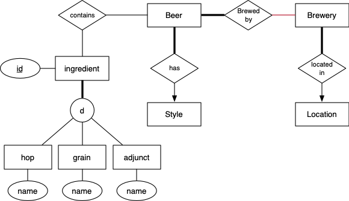
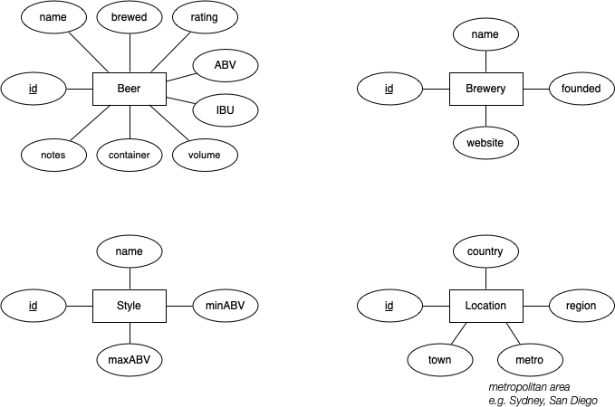

# SQL_practice_on_small_scheme_Database
The assignment provides practice in understanding a small relational schema, implementing SQL queries and views, and implementing PLpgSQL functinos to satisfy requests for information.
The design of the database is shown as follows:

The attributes of entities are as follows:

Setup of database:
$ dropdb ass1 
Create a new empty atabase 
$ createdb ass1 
Load the database, saving the output in a file called log 
$ psql ass1 -f ass1.dump > log 2>&1 
Check for error messages in the log; should be none 
$ grep ERR log 
Examine the database contents ... 
$ psql ass1 

Functions:
1. Displays all breweries founded in the Sydney metropolitan area in 2020.
2. Displays the names and breweries of all beers whose name is the same as their style.
3. Displays the name and foundation year of the oldest brewery located in California.
4. Displays a list of all IPA variations and a count of the number of beers brewed in that style.
5. Displays the name and most precise location of each brewery located in California. If we know the town/suburb name, that will be used. If not, give the name of the metropolitan area (e.g. San Diego) where it's located.
6. Displays the strongest barrel-aged beer(s), giving the beer name, the brewery name(s), and the strength (ABV = percentage alcohol by volume).
7. Displays the most frequently used hop variety.
8. Displays beer styles that include precisely the string "IPA" or "Lager" or "Stout" somewhere in the style name.
9. Displays the name of the most commonly used grain of the beers whose style is exactly the string "Hazy IPA".
10. Displays the names of any ingredients that are not used in making any of the beers in the database.
11. Returns an ABV range tuple containing the minimum and maximum ABVs of all beers brewed in any given country in the database.
12. Returns information about all beers that contain any given string somewhere in their name (matching made in a case-insensitive way).

Grade: 98%